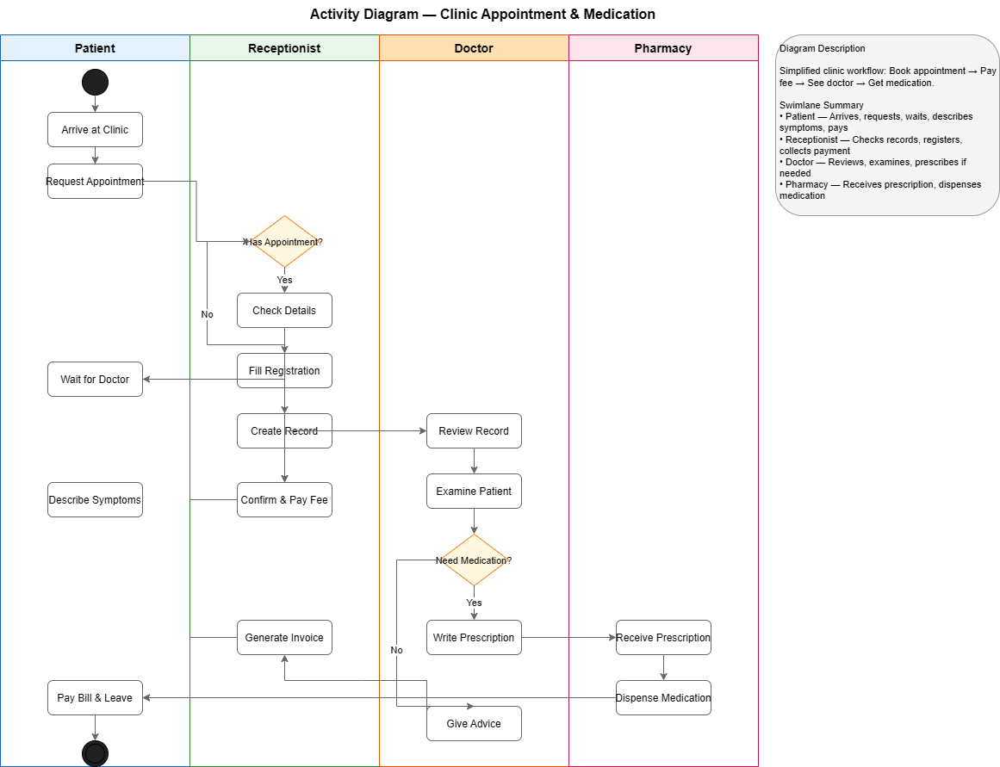

# Week 5 - Activity 3: Clinic Management System Activity Diagram

This repository contains the Activity Diagram for a clinic management system...

## 1. Activity Diagram Overview

## 2. Step-by-Step Workflow Description

### Phase 1: Appointment Booking
1. Arrive at Clinic (Patient)
2. Request Appointment (Patient)
3. Check Appointment Status (Receptionist - Decision)
   - If Yes: Check Details
   - If No: Fill Registration → Create Record
4. Confirm & Pay Booking Fee

### Phase 2: Waiting & Consultation
5. Wait for Doctor (Patient)
6. Review Record (Doctor)
7. Examine Patient (Doctor)
8. Need Medication? (Doctor - Decision)
   - If Yes: Write Prescription
   - If No: Give Advice

### Phase 3: Medication Fulfillment
9. Receive Prescription (Pharmacy)
10. Dispense Medication (Pharmacy)
11. Order Medication (Patient)

### Phase 4: Final Payment & Departure
12. Generate Invoice (Receptionist)
13. Pay Bill & Leave (Patient)

## 3. Swimlane Summary
| Swimlane | Role | Key Responsibilities |
| Patient | End User | Arrives, requests, waits, pays, collects meds |
| Receptionist | Front Desk | Checks appointments, records, payments, invoices |
| Doctor | Medical Provider | Reviews, examines, diagnoses, prescribes |
| Pharmacy | Fulfillment | Receives prescriptions, dispenses medication |

## 4. Design Note
- Workflow Scope: End-to-end patient visit
- Decision Points: 2 key nodes (Has Appointment? / Need Medication?)
- Integrated Service: Pharmacy treated as clinic-integrated
- Simplification: Nurse role merged into Doctor swimlane